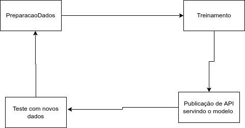

# Projeto ENG ML
Análise Kobe

## Pipeline

Crie uma solução seguindo as orientações:

1. A solução criada nesse projeto deve ser disponibilizada em repositório git e disponibilizada em servidor de repositórios (Github (recomendado), Bitbucket ou Gitlab). O projeto deve obedecer o Framework TDSP da Microsoft. Todos os artefatos produzidos deverão conter informações referentes a esse projeto (não serão aceitos documentos vazios ou fora de contexto). Escreva o link para seu repositório. 

2. Iremos desenvolver um preditor de arremessos usando duas abordagens (regressão e classificação) para prever se o "Black Mamba" (apelido de Kobe) acertou ou errou a cesta.
Para começar o desenvolvimento, desenhe um diagrama que demonstra todas as etapas necessárias em um projeto de inteligência artificial desde a aquisição de dados, passando pela criação dos modelos, indo até a operação do modelo.'

3. Descreva a importância de implementar pipelines de desenvolvimento e produção numa solução de aprendizado de máquinas. 
### Resposta: para automatizar varios processos da entrega, modularizar o projeto, garantir q qualidade do modelo em produćão, pipelines são importantes entender melhor os detalhes de cada etapa, podendo utilizar diferentes tecnicas/processos/times em cada uma  

4. Como as ferramentas Streamlit, MLFlow, PyCaret e Scikit-Learn auxiliam na construção dos pipelines descritos anteriormente? A resposta deve abranger os seguintes aspectos:
    a. Rastreamento de experimentos;
    b. Funções de treinamento;
    c. Monitoramento da saúde do modelo;
    d. Atualização de modelo;
    e. Provisionamento (Deployment).
   
### Resposta: MLFlow padroniza as entregas, definindo um ambiente onde cada item do pipeline é documentado e versionado, PyCaret/Scikit-Learn simplifica a criação de modelos

5. Com base no diagrama realizado na questão 2, aponte os artefatos que serão criados ao longo de um projeto. Para cada artefato, indique qual seu objetivo.

6.Implemente o pipeline de processamento de dados com o mlflow, rodada (run) com o nome "PreparacaoDados":

a. Os dados devem estar localizados em "/Data/kobe_dataset.csv"

b. Observe que há dados faltantes na base de dados! As linhas que possuem dados faltantes devem ser desconsideradas. Você também irá filtrar os dados onde o valor de shot_type for igual à 2PT Field Goal. Ainda, para esse exercício serão apenas consideradas as colunas: 

i. lat

ii. lng

iii. minutes remaining

iv. period

v. playoffs

vi. shot_distance

A variável shot_made_flag será seu alvo, onde 0 indica que Kobe errou e 1 que a cesta foi realizada. O dataset resultante será armazenado na pasta "/Data/processed/data_filtered.parquet". Ainda sobre essa seleção, qual a dimensão resultante do dataset?

c. Separe os dados em treino (80%) e teste (20 %) usando uma escolha aleatória e estratificada. Armazene os datasets resultantes em "/Data/operalization/base_{train|test}.parquet . Explique como a escolha de treino e teste afetam o resultado do modelo final. Quais estratégias ajudam a minimizar os efeitos de viés de dados.

d. Registre os parâmetros (% teste) e métricas (tamanho de cada base) no MlFlow

7. Implementar o pipeline de treinamento do modelo com o Mlflow usando o nome "Treinamento"

a. Com os dados separados para treinamento, treine um modelo com regressão logística do sklearn usando a biblioteca pyCaret.

b. Registre a função custo "log loss" usando a base de teste

c. Com os dados separados para treinamento, treine um modelo de classificação do sklearn usando a biblioteca pyCaret. A escolha do algoritmo de classificação é livre. Justifique sua escolha.

d. Registre a função custo "log loss" e F1_score para esse novo modelo

8. Registre o modelo de classificação e o disponibilize através do MLFlow através de API. Selecione agora os dados da base de dados original onde shot_type for igual à 3PT Field Goal (será uma nova base de dados) e através da biblioteca requests, aplique o modelo treinado. Publique uma tabela com os resultados obtidos e indique o novo log loss e f1_score.

a. O modelo é aderente a essa nova base? Justifique.
### Resposta: Não é aderente, 2pts - precisao	0.606, 3pts - precisao	0.327

b. Descreva como podemos monitorar a saúde do modelo no cenário com e sem a disponibilidade da variável resposta para o modelo em operação

 c. Descreva as estratégias reativa e preditiva de retreinamento para o modelo em operação.

9. Implemente um dashboard de monitoramento da operação usando Streamlit.